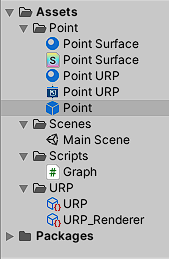

# unity_graph
Mathematical 2D graph animation in Unity with time component
Discretization is done using 3D cubes.

## Prerequisites
- Unity 2020.3.14f1
- Rider 2021.1.4
- Windows Operating System

## Abstract

- Create a cube as prefab to represent a point in the plot.
- Instantiate multiple cubes from the prefab. Number of cubes depends on the resolution
  defined
- Show a mathematical function by defining x and y positions for each cube (z-axes is omitted).
- Color surfaces according to cube positions using a surface shader scripted 
  with cg_language or using shader graph with visual URP Editor. 
  
  URP must be installed via package manager.
- Animate the graph. This is achieved in _MonoBehaviour.Update()_ Message which updates cubes coordinates
  every frame.
  
## Side Notes

Directory structure is very straightforward

Point is the prefab using either **Point Surface material** for surface shader or **Point URP** 
material for URP Shader.